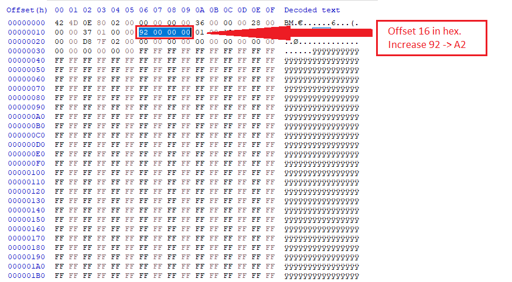
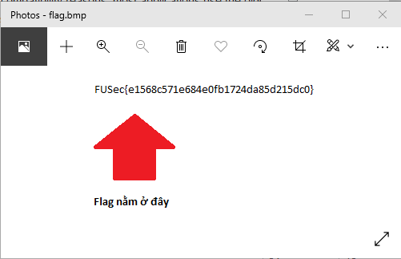

# FU Secathon Writeup

2021 - Forensics category

# FRS301

## Brief

The challenge is about hidden file height (the real height of image might be 500 but it only show 300).

We need to understand which byte of the file header contains height information.

[Dowload file here](flag.bmp)

## Details

**File Header**:

> File header are usually stored at the start of the file, they can easily be examined by using simple software such as a text editor or a hexadecimal editor.
> 
> File headers may contain metadata about the file and its contents. For example, most image files store information about image format, size, resolution and color space, and optionally authoring information such as who made the image, when and where it was made, what camera model and photographic settings were used (exif data), and so on.
> 
> Source: Wikipedia - File Header

Now we know that image metadata can contains size data. Next is to identify where is it?

In the [Bitmap file header structure](https://en.wikipedia.org/wiki/BMP_file_format#Bitmap_file_header), we can see that `the common Windows format is the BITMAPINFOHEADER header`, and the bitmap height in pixels according to the table has offset **16** in hex.

Upon inspecting the image in HxD, we can *increase the hex value in offset 16 (hex)*, the flag is now visible.

After the header is changed:

